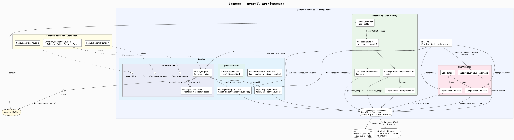
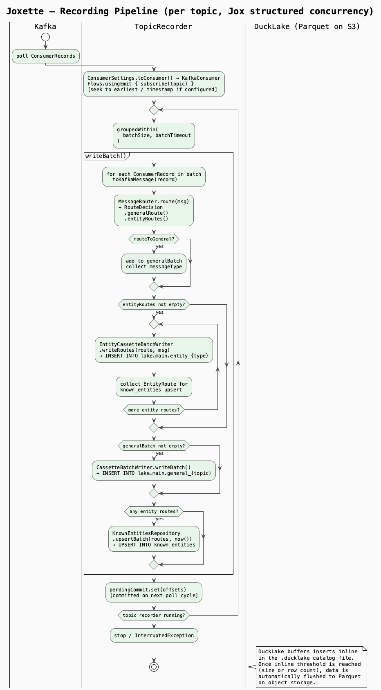
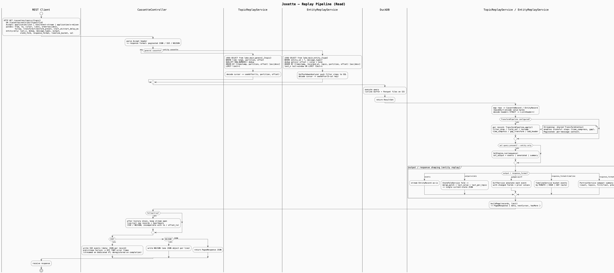
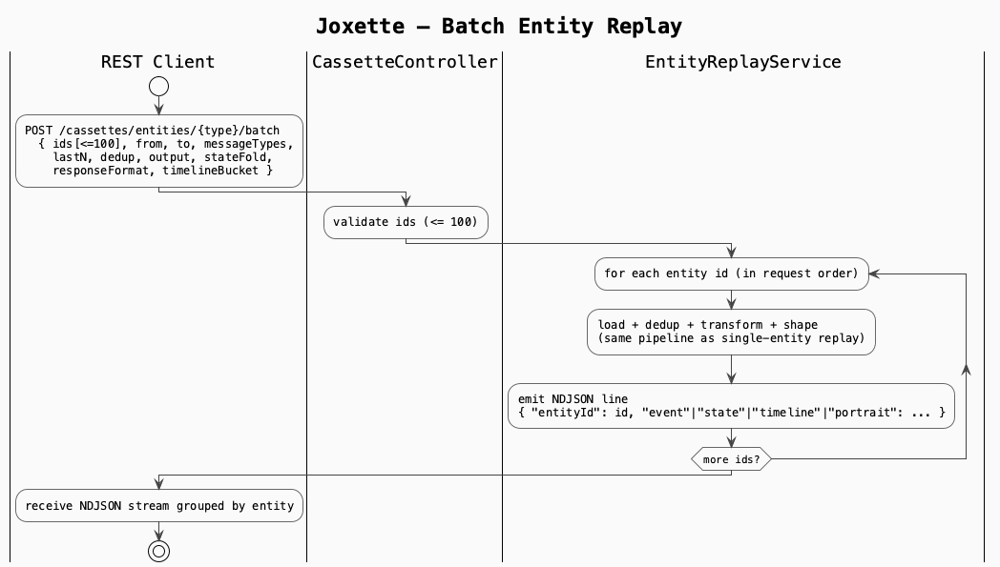
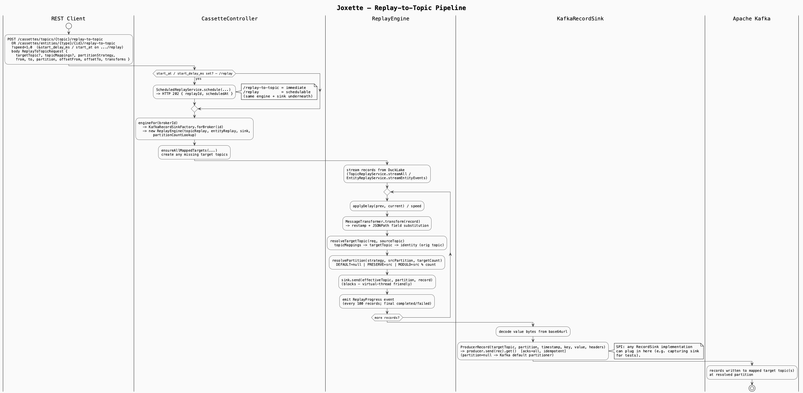
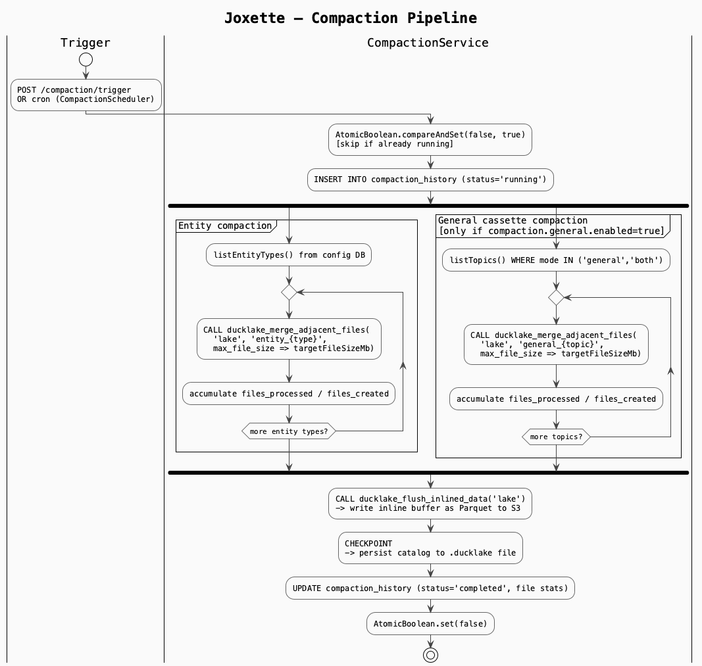
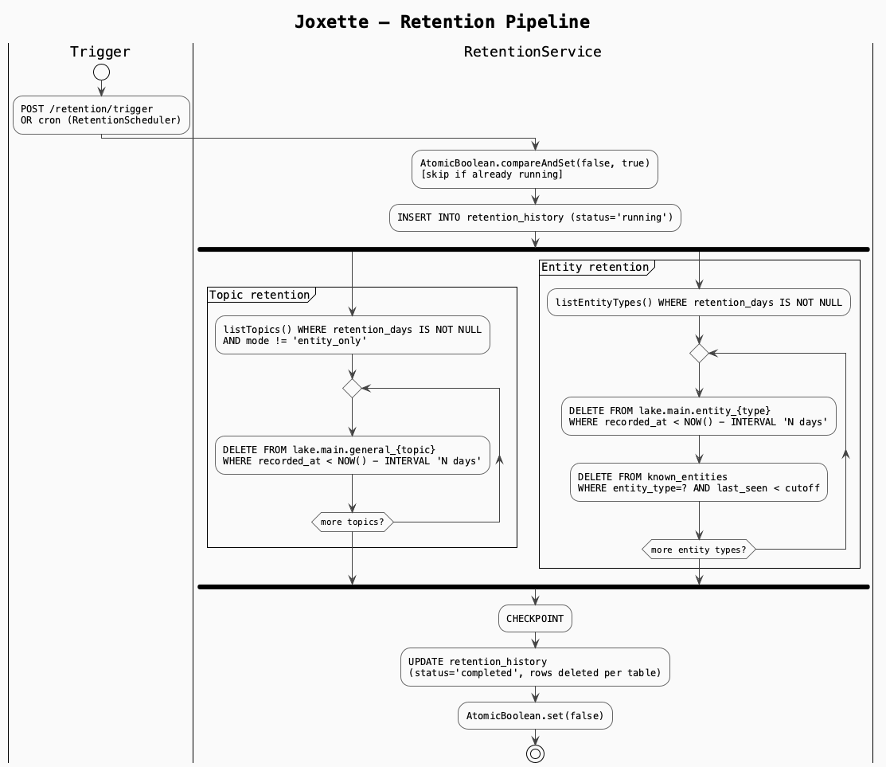
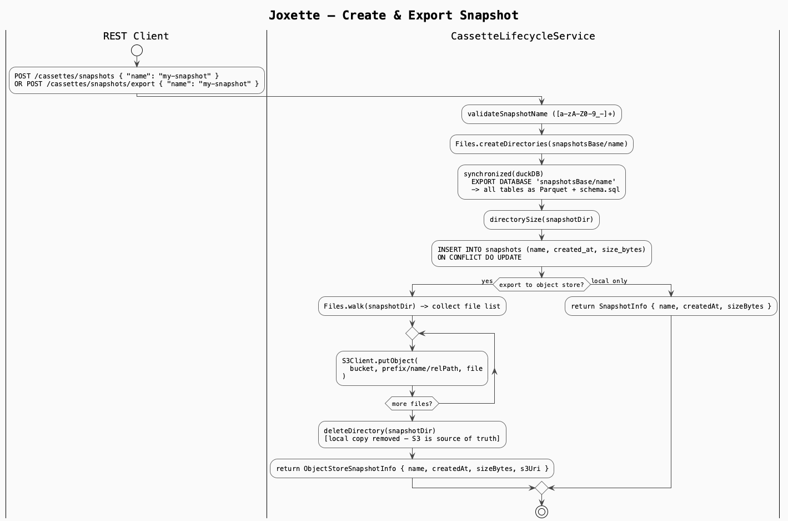
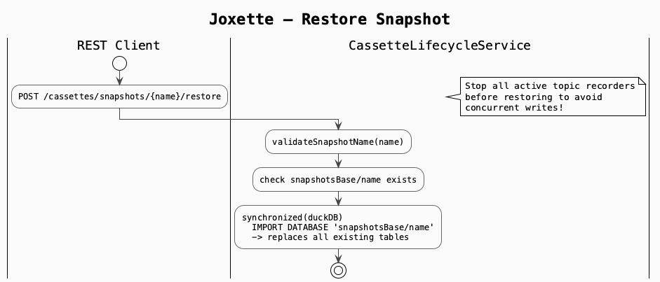
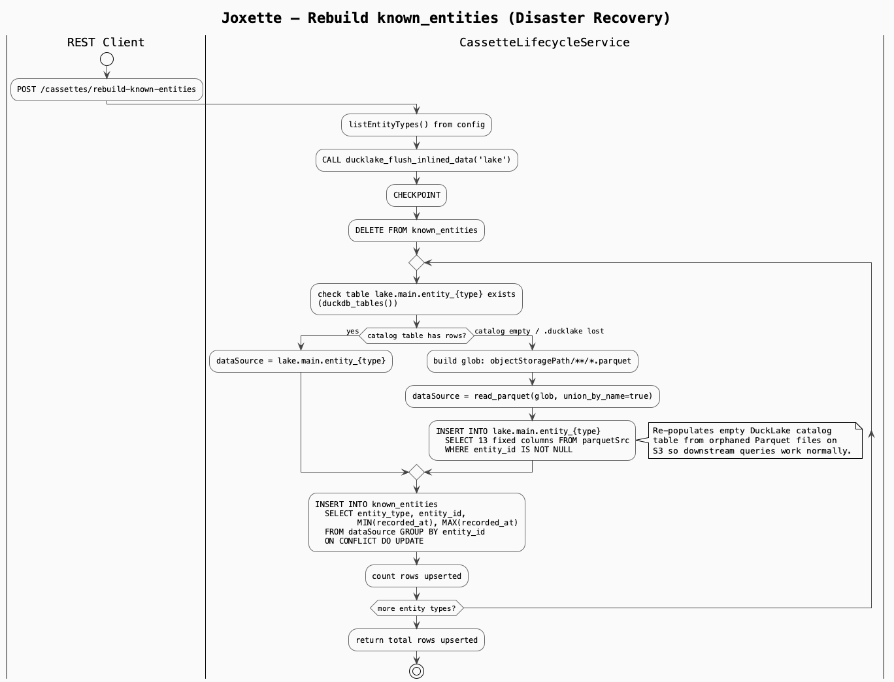

# Joxette 📼

> **Kafka Topic Cassette Recorder** — Record Kafka topics into replayable archives stored in DuckLake, backed by object storage.

Joxette records Kafka topics into **cassettes** — durable, queryable archives that can be replayed on demand. Cassettes can capture the raw topic stream in order (**general cassettes**) or aggregate messages by business entity across multiple topics (**entity cassettes**).

Storage is powered by [DuckLake](https://ducklake.select/), using its **data inlining** feature to buffer small writes in a local DuckDB catalog before flushing to Parquet on object storage (S3, GCS, Azure). This minimises S3 PUT costs and avoids the small-files problem without any application-level orchestration.

---

## Contents

- [Features](#features)
- [Architecture](#architecture)
- [Tech Stack](#tech-stack)
- [Quick Start](#quick-start)
- [Configuration](#configuration)
- [REST API](#rest-api)
- [UI](#ui)
- [Development](#development)
- [Project Structure](#project-structure)

---

## Features

- 🎙️ **General cassettes** — raw topic stream preserved in arrival order, one DuckLake table per topic
- 🏷️ **Entity cassettes** — messages for a specific business entity (order, user, device…) aggregated across multiple topics, indexed for fast lookup
- 🔍 **Flexible replay** — paginated JSON, SSE streaming, or NDJSON for all cassettes
- 🗂️ **Cursor-based pagination** — logical cursors stable across physical storage changes (Parquet compaction, DuckLake inlining)
- 🗜️ **Compaction** — scheduled or on-demand Parquet file merging to optimise read performance
- 🏗️ **Bootstrap config** — seed topics and entity types from YAML on first start; REST API takes over afterwards
- 📊 **Observability** — Spring Actuator health endpoint, Prometheus metrics, Swagger UI at `/swagger-ui.html`
- 🗑️ **GDPR support** — delete all data for a specific entity ID
- 🏷️ **Instance roles** — gate subsystems (recorder, replay, compaction) per instance for role-based deployments
- 🌐 **Pekko cluster membership** — gossip-based cluster; `GET /instances` (DB heartbeat view) and `GET /instances/topology` (Pekko phi-accrual, ~10 s failure detection) for live membership
- 🔒 **ClusterSingleton compaction** — Pekko `ClusterSingleton` guarantees exactly one compaction actor runs cluster-wide; replaces the `compaction_locks` DB table
- 🎛️ **Supervised recorder lifecycle** — per-topic `TopicLifecycleActor` with Pekko exponential-backoff supervisor; replaces Resilience4j retry
- 🔄 **KIP-848 rebalance support** — scoped partition drain on cooperative rebalance; non-revoked partitions continue without pause (Kafka 4.x)
- 🧵 **`BackgroundTaskRegistry`** — unified lifecycle manager for ad-hoc virtual threads (exports, live-metrics SSE, manual retention); `SmartLifecycle` phase `MAX_VALUE − 2048` ensures orderly interrupt + join before Pekko shutdown

---

## Architecture

> Diagrams are kept as PlantUML sources in [`docs/`](docs/). PNG files are checked in alongside the sources. To regenerate after editing a `.puml` file, run:
> ```bash
> mvn exec:exec@generate-puml-diagrams
> ```
> Diagram generation is **not** bound to the default build lifecycle — `mvn compile` / `mvn test` / `mvn verify` do not regenerate PNGs.

### Overall Architecture



Single process. DuckDB is embedded. Each Kafka consumer topic runs in its own [Jox](https://jox.softwaremill.com/) structured-concurrency scope, providing clean start/stop semantics and back-pressure via flow operators. All threads share one DuckDB JDBC connection; DuckDB serialises writes internally.

### Recording Pipeline



Back-pressure is natural: slow DuckLake writes → batch buffer fills → Kafka consumption slows → consumer lag increases. Lag is the pressure valve.

### Replay Pipeline







The read path supports cursor pagination, SSE/NDJSON streaming, `follow=true`
live-tail, and — for entity cassettes — alternate shapes: `output=state`
(fold to current state), `output=diff` (per-event field deltas),
`response_format=timeline` (time-bucketed), and `response_format=portrait`
(compact summary).

Replay-to-topic is built around a small `RecordSink` SPI
(`com.joxette.replay.sink.RecordSink`). `ReplayEngine` is plain Java — no
Spring, no Kafka imports — so the same engine can run inside the service or
from a test-kit that wires it up with a capturing sink. The production
implementation (`KafkaRecordSink` + `KafkaRecordSinkFactory`) caches one
`KafkaProducer` per broker id and handles byte/header/timestamp encoding. Per-
record `topicMappings` route each source topic to its own target (default:
the original name), and a `partitionStrategy` (`DEFAULT`/`PRESERVE`/`MODULO`)
controls how source partitions map onto the target when partition counts
differ.

### Compaction & Retention





### Snapshots & Disaster Recovery








---

## Tech Stack

| Component | Technology | Version |
|---|---|---|
| Language | Java (preview features enabled) | JDK 25 |
| Framework | Spring Boot | 4.0.5 |
| Build | Maven | — |
| Concurrency / Flows | [Jox](https://jox.softwaremill.com/) (softwaremill) | 0.5.x / 1.1.x |
| Cluster / Supervision | [Apache Pekko](https://pekko.apache.org/) (actor system, ClusterSingleton) | 1.1.3 |
| Kafka | Apache Kafka clients (via Jox Kafka) | — |
| Database / Catalog | DuckDB JDBC | 1.5.3.0 |
| Lakehouse storage | DuckLake extension | — |
| SQL DSL | jOOQ (DDLDatabase codegen) | 3.19.x |
| API docs | SpringDoc OpenAPI / Swagger UI | 2.8.x |
| Object storage | Delegated to DuckDB httpfs + DuckLake | — |
| Testing | JUnit 5 + Testcontainers (Kafka) | 1.21.x |
| UI | React 19, TanStack Router/Query/Table, Tailwind CSS v4 | — |
| Dev Kafka | Apache Kafka (KRaft, native image) via Docker | — |
| Topic provisioning | [Jikkou](https://www.jikkou.io/) | — |

---

## Quick Start

### Prerequisites

- Java 25+ (with `--enable-preview`; JDK 26 recommended)
- Maven 3.9+
- Docker + Docker Compose
- Node 20+ and [pnpm](https://pnpm.io/) (for the UI)

### 1. Start Kafka locally

```bash
docker compose up -d
```

This starts a single-node KRaft Kafka broker on `localhost:9092` and runs Jikkou to create the `events` topic.

### 2. Run the backend

```bash
# Set JAVA_25_HOME if not already in PATH
export JAVA_25_HOME=$(/usr/libexec/java_home -v 25)

mvn spring-boot:run
```

The service starts on **http://localhost:8080**.

On first start, Joxette initialises the DuckDB catalog, creates the DuckLake schema, and seeds the `events` topic from the bootstrap config in `application.yml`.

- Swagger UI: http://localhost:8080/swagger-ui.html
- API docs: http://localhost:8080/v3/api-docs
- Health: http://localhost:8080/actuator/health
- Metrics (Prometheus): http://localhost:8080/actuator/prometheus

### 3. Run the UI (optional)

```bash
cd ui
pnpm install
pnpm dev
```

The UI dev server starts on **http://localhost:5173** and proxies API calls to the backend.

---

## Configuration

All configuration lives in `src/main/resources/application.yml`. Override any value with environment variables (Spring's `JOXETTE_*` prefix convention) or a profile-specific file.

```yaml
joxette:

  # DuckLake catalog – the DuckDB file is the lakehouse catalog.
  # catalog.path URI prefix selects the backend automatically:
  #   bare path / file://  → embedded DuckDB (default, single process)
  #   quack://host:port    → Quack server (DuckDB 1.5.3+, beta, multi-process)
  #   postgres://…         → PostgreSQL (multi-process, full HA)
  # See docs/catalog-scaling.md for the three-stage migration runbook.
  catalog:
    path: "./data/joxette.ducklake"
    object-storage-path: ""           # e.g. s3://my-bucket/joxette/data

  # Inline-buffering thresholds. DuckLake buffers data here before flushing to Parquet.
  inline:
    threshold-mb: 4
    threshold-records: 50000

  # Kafka connection
  kafka:
    bootstrap-servers: "localhost:9092"

  # Recording pipeline batching
  recording:
    batch-size: 10000
    batch-timeout-ms: 1000

  # Compaction (merges small Parquet files)
  compaction:
    schedule: "0 0 3 * * *"          # Spring cron: daily at 03:00
    entity:
      min-files-per-bucket: 10
      target-file-size-mb: 256
      lookback-days: 30
    general:
      enabled: false

  # Role-based subsystem gating (default: all roles active on every instance)
  # Useful for running dedicated recorder vs. replay vs. compaction nodes.
  roles:
    recorder: true
    replay: true
    compaction: true

  # CORS origins allowed to call the REST API
  cors:
    allowed-origins:
      - http://localhost:5173

  # Bootstrap seed – loaded only when config tables are empty on first start.
  bootstrap:
    topics:
      - topic: "events"
        mode: "general"
    entities: []
```

### Topic Modes

| Mode | Behaviour |
|---|---|
| `general` | Record raw stream only |
| `entity_only` | Extract entities and write to entity cassettes only |
| `both` | Record general stream **and** route to entity cassettes |

### Object Storage (Production)

Set `JOXETTE_CATALOG_OBJECT-STORAGE-PATH` to point DuckLake at your bucket.
All S3/GCS/Azure interaction is handled by DuckDB's `httpfs` extension — no
Java SDK required.

```bash
JOXETTE_CATALOG_OBJECT-STORAGE-PATH=s3://my-bucket/joxette/data
```

See **[docs/object-storage.md](docs/object-storage.md)** for the full guide:
path format per provider, `CREATE SECRET` syntax, required IAM/SA permissions,
and working `application.yml` snippets for AWS S3, GCS, and Azure Blob.

---

## REST API

Swagger UI is available at **http://localhost:8080/swagger-ui.html**.

### Topic Recording Management

| Method | Path | Description |
|---|---|---|
| `GET` | `/topics` | List all configured topic recordings |
| `POST` | `/topics` | Register a topic for recording |
| `GET` | `/topics/{topic}` | Config and stats for a topic |
| `PUT` | `/topics/{topic}` | Update topic config |
| `DELETE` | `/topics/{topic}` | Stop recording (data preserved) |
| `POST` | `/topics/{topic}/pause` | Pause consumption |
| `POST` | `/topics/{topic}/resume` | Resume consumption |

### Entity Type Management

| Method | Path | Description |
|---|---|---|
| `GET` | `/entities` | List all entity types with stats |
| `POST` | `/entities` | Register a new entity type |
| `GET` | `/entities/{entity_type}` | Config, source mappings, stats |
| `PUT` | `/entities/{entity_type}` | Update entity config |
| `DELETE` | `/entities/{entity_type}` | Remove entity type (data preserved) |
| `GET` | `/entities/{entity_type}/sources` | List topic → entity mappings |
| `POST` | `/entities/{entity_type}/sources` | Add a source topic mapping |
| `DELETE` | `/entities/{entity_type}/sources/{topic}` | Remove a source mapping |

### Cassette Replay

All replay endpoints support three response formats via the `Accept` header:

| Accept | Format |
|---|---|
| `application/json` | Paginated JSON (default) |
| `text/event-stream` | SSE streaming |
| `application/x-ndjson` | NDJSON streaming |

**General cassettes:**

| Method | Path | Key Query Params |
|---|---|---|
| `GET` | `/cassettes/topics/{topic}` | `from`, `to`, `partition`, `offset_from`, `offset_to`, `limit`, `cursor`, `order=asc\|desc`, `follow`, `transform`/`transform_preset`, `start_at`/`start_delay_ms` |

**Entity cassettes:**

| Method | Path | Description |
|---|---|---|
| `GET` | `/cassettes/entities/{entity_type}` | List known entity IDs |
| `GET` | `/cassettes/entities/{entity_type}/{entity_id}` | Replay entity history (see params below) |
| `GET` | `/cassettes/entities/{entity_type}/{entity_id}/stats` | Message count, time range, topics |
| `GET` | `/cassettes/entities/{entity_type}/search` | Find entities matching criteria |
| `POST` | `/cassettes/entities/{entity_type}/batch` | Replay up to 100 entity IDs in one NDJSON stream |

Entity replay (`GET …/{entity_id}`) accepts, in addition to `from`/`to`/`limit`/`cursor`/`order`/`follow`:

| Param | Values (default) | Effect |
|---|---|---|
| `last_n` | integer | Tail window — only the last N events (mutually exclusive with `from`/`to`/`cursor`) |
| `dedup` | `offset` (default), `value`, `none` | Deduplication key for re-deliveries |
| `message_types` | comma-separated | Restrict to these message-type labels |
| `output` | `events` (default), `state`, `diff` | Stream events, fold to current-state JSON, or annotate each event with field deltas |
| `state_fold` | `merge_patch` (default), `last_value`, `last_per_topic` | Fold strategy when `output=state` |
| `response_format` | `events` (default), `timeline`, `portrait` | Raw events, time-bucketed timeline, or compact summary (JSON only) |
| `timeline_bucket` | `MINUTE`, `HOUR`, `DAY` (auto) | Bucket granularity when `response_format=timeline` |
| `sol` | SOL query string | Run a Sequence Operations Language query over the full sequence |
| `sol_output` | `events` (default), `annotated`, `summary` | What a `sol` query returns |

**Replay to Kafka:**

| Method | Path | Description |
|---|---|---|
| `POST` | `/cassettes/topics/{topic}/replay-to-topic` | Stream a general cassette back into Kafka (immediate) |
| `POST` | `/cassettes/entities/{entity_type}/{entity_id}/replay-to-topic` | Stream an entity cassette back into Kafka (immediate) |
| `POST` | `/cassettes/topics/{topic}/replay` | Same as above but schedulable via `start_at`/`start_delay_ms` (returns `202` with a replay id) |
| `POST` | `/cassettes/entities/{entity_type}/{entity_id}/replay` | Schedulable entity replay-to-topic |
| `GET` | `/cassettes/scheduled` | List pending/running scheduled replays |
| `DELETE` | `/cassettes/scheduled/{id}` | Cancel a pending scheduled replay |

Replay-to-topic takes a `?speed=` multiplier (1.0 = real-time) and a `ReplayToTopicRequest` body:

| Field | Type | Effect |
|---|---|---|
| `targetTopic` | string | Destination topic. Optional — omit (with no `topicMappings`) for **identity routing**: each record replays back to its original topic |
| `topicMappings` | `{source: target}` | Per-source-topic routing overrides; topics absent from the map fall back to `targetTopic`, then to the original name |
| `partitionStrategy` | `DEFAULT` / `PRESERVE` / `MODULO` | How source partitions map to the target. `DEFAULT` = Kafka partitioner; `PRESERVE` = verbatim (requires equal partition counts); `MODULO` = `source % target_count` |
| `from`, `to`, `partition`, `offsetFrom`, `offsetTo` | filters | Restrict which recorded records are replayed (offset/partition filters apply to topic replay only) |
| `transforms` | object | `restamp` (re-anchor timestamps to now) + JSONPath `fieldSubstitutions` |

**SOL & sequence matching:**

| Method | Path | Description |
|---|---|---|
| `POST` | `/cassettes/topics/{topic}/match-sequences` | NFA-style sequence match over a topic; returns match stats + examples |
| `POST` | `/cassettes/entities/{entity_type}/match-sequences` | Sequence match over an entity (via `entityId` param) |
| `POST` | `/cassettes/topics/{topic}/sol-match` | Run a SOL query over a topic's messages |
| `POST` | `/cassettes/entities/{entity_type}/{entity_id}/sol-match` | Run a SOL query over an entity's event sequence |

**Cassette lifecycle:**

| Method | Path | Description |
|---|---|---|
| `GET` | `/cassettes/topics/{topic}/stats` | File count, size, inlined vs. flushed |
| `POST` | `/cassettes/topics/{topic}/compact` | Trigger general cassette compaction |
| `POST` | `/cassettes/topics/{topic}/truncate` | Delete data before a timestamp |
| `POST` | `/cassettes/entities/{entity_type}/compact` | Trigger entity compaction |
| `POST` | `/cassettes/entities/{entity_type}/truncate` | Delete entity data before a timestamp |
| `POST` | `/cassettes/entities/{entity_type}/{entity_id}/delete` | Delete entity (GDPR) |
| `GET` | `/cassettes/snapshots` | List DuckLake snapshots |
| `POST` | `/cassettes/snapshots/{snapshot_id}/restore` | Restore a snapshot |

**Compaction & operations:**

| Method | Path | Description |
|---|---|---|
| `GET` | `/compaction/status` | Running/idle, last run, next scheduled |
| `POST` | `/compaction/trigger` | Trigger compaction (optional scope in body) |
| `GET` | `/compaction/history` | Past compaction runs with stats |
| `GET` | `/compaction/locks` | Always returns `[]` — locking is now handled by ClusterSingleton |
| `GET` | `/health` | Liveness, consumer lag, catalog size, cluster counts |

**Cluster & instance registry:**

| Method | Path | Description |
|---|---|---|
| `GET` | `/instances` | List instances from the DB heartbeat table (30 s resolution) |
| `GET` | `/instances/topology` | Live Pekko cluster topology (~10 s phi-accrual failure detection) |

### Pagination

Cursor-based pagination encodes the last message's logical position (timestamp + partition + offset for general, or timestamp + source info for entity cassettes). Cursors are stable across compaction and inlining flushes.

```json
{
  "messages": [...],
  "cursor": "eyJ0c...",
  "has_more": true
}
```

---

## UI

The `ui/` directory contains a React 19 single-page application built with:

- **TanStack Router** — file-based SPA routing
- **TanStack Query** — server-state management
- **TanStack Table** — virtualised data grids
- **Tailwind CSS v4** — utility-first styling
- **Vite** — build tooling

### UI Routes

| Route | Description |
|---|---|
| `/` | Dashboard / home |
| `/topics` | Topic recording list and management |
| `/topics/{topic}` | Topic cassette replay |
| `/entities` | Entity type list |
| `/entities/{entityType}` | Entities within a type |
| `/entities/{entityType}/{entityId}` | Entity history replay |
| `/snapshots` | DuckLake snapshot browser |
| `/compaction` | Compaction status and history |
| `/retention` | Retention status and history |
| `/health` | Service health (includes cluster instance counts) |

### UI Development

```bash
cd ui
pnpm install
pnpm dev        # start dev server at http://localhost:5173
pnpm build      # production build
pnpm test       # run Vitest tests
```

---

## Development

### Running Tests

```bash
export JAVA_25_HOME=$(/usr/libexec/java_home -v 25)
mvn test
```

Integration tests use Testcontainers with `apache/kafka-native:4.0.2` — a GraalVM-compiled native image that starts in ~1–2 s (vs ~10–15 s for the JVM-based Confluent image). Tests validate against the KIP-848 cooperative rebalance protocol used by Kafka 4.x. A `JAVA_25_HOME` environment variable is required because the Surefire plugin needs the Java 25+ JVM to support preview-compiled classes.

### Managing Kafka Topics with Jikkou

Topic definitions live in `jikkou/topics.yml`. During `docker compose up`, Jikkou applies them automatically. To apply or reconcile manually:

```bash
# Apply (create / update)
jikkou apply --files jikkou/topics.yml

# Diff only
jikkou diff --files jikkou/topics.yml
```

### Code Generation (jOOQ)

jOOQ classes are generated from `src/main/resources/db/jooq-codegen-schema.sql` at build time via the Maven `generate-sources` phase. To regenerate after schema changes:

```bash
mvn generate-sources
```

Generated sources land in `target/generated-sources/jooq/`.

---

## Project Structure

Joxette is a Maven multi-module build. Modules are layered so the replay engine
and its SPIs can be consumed without dragging in Spring, DuckDB, or Kafka.

```
joxette/
├── pom.xml                          # Parent POM — <modules> + dependencyManagement + pluginManagement
├── docker-compose.yml               # Local Kafka (KRaft, apache/kafka-native)
├── docs/                            # PlantUML sources + rendered PNGs
├── jikkou/                          # Kafka topic definitions (topics.yml, jikkou.yml)
│
├── joxette-core/                    # Pure Java. No Spring / DuckDB / Kafka on the classpath.
│   └── src/main/java/com/joxette/replay/
│       ├── CassetteRecord, EntityRecord, PagedResponse, ReplayProgress, ReplayToTopicRequest,
│       │                                ReplayTransformConfig, FieldSubstitution     (DTOs)
│       ├── CassetteSource, EntityCassetteSource                                      (SPIs)
│       ├── MessageTransformer                                                        (restamp + JSONPath)
│       ├── ReplayEngine                                                              (orchestrator)
│       └── sink/{RecordSink, SinkException}                                          (sink SPI)
│
├── joxette-kafka/                   # Depends on joxette-core + kafka-clients.
│   └── src/main/java/com/joxette/replay/sink/kafka/KafkaRecordSink.java
│
├── joxette-service/                 # Spring Boot app. Depends on joxette-core + joxette-kafka.
│   ├── pom.xml                      # Owns jOOQ codegen + PlantUML exec plugin
│   └── src/
│       ├── main/java/com/joxette/
│       │   ├── JoxetteApplication.java
│       │   ├── config/              # Spring beans: DuckDB, Kafka, S3, Web, Scheduling, OpenAPI
│       │   ├── db/                  # DuckLakeManager, SchemaManager
│       │   ├── lifecycle/           # BackgroundTaskRegistry (SmartLifecycle, phase MAX_VALUE-2048)
│       │   ├── management/          # Topic / Entity / Broker controllers, config repository
│       │   ├── recording/           # Kafka consumer + batch writers (jox)
│       │   ├── replay/              # TopicReplayService (CassetteSource impl),
│       │   │                        # EntityReplayService (EntityCassetteSource impl),
│       │   │                        # CassetteController, KafkaRecordSinkFactory,
│       │   │                        # MessageRouter, transform/ (jOOQ-bound pipeline)
│       │   └── compaction/          # Compaction + Retention services, schedulers, controllers
│       ├── main/resources/
│       │   ├── application.yml
│       │   └── db/{init.sql, jooq-codegen-schema.sql}
│       └── test/java/com/joxette/
│           ├── compaction/ recording/ replay/ management/           # unit tests
│           ├── it/                  # Integration tests (Testcontainers Kafka + DuckDB)
│           └── support/             # DuckDB test support utilities
│
├── joxette-test-kit/                # Depends on joxette-core + joxette-kafka. No DuckDB, no Spring.
│   └── src/main/java/com/joxette/testkit/
│       ├── InMemoryCassetteSource        # impl CassetteSource
│       ├── InMemoryEntityCassetteSource  # impl EntityCassetteSource
│       ├── CapturingRecordSink           # impl RecordSink (non-Kafka; captures sends)
│       └── ReplayEngineBuilder           # fluent builder — wires a ReplayEngine in-process
│
└── ui/                              # React 19 frontend (pnpm)
    ├── src/
    │   ├── api/                     # API client
    │   ├── components/              # Shared UI components
    │   ├── hooks/                   # Custom React hooks
    │   ├── routes/                  # TanStack Router file-based routes
    │   └── stores/                  # Zustand stores
    └── public/
```

### Module boundaries

| Module | Depends on | Forbidden on classpath |
|---|---|---|
| `joxette-core` | slf4j-api, jackson-annotations, swagger-annotations-jakarta, json-path | Spring, DuckDB, jOOQ, Kafka |
| `joxette-kafka` | joxette-core, kafka-clients | Spring, DuckDB, jOOQ |
| `joxette-service` | joxette-core, joxette-kafka, Spring Boot, DuckDB, jOOQ, jox | — |
| `joxette-test-kit` | joxette-core, joxette-kafka | DuckDB, jOOQ, Spring |

---

## Design Notes

**Deduplication on read** — Kafka delivers at-least-once, so duplicates are possible. Joxette stores duplicates and deduplicates at query time using `(topic, partition, offset)` as the unique key. `QUALIFY` / `DISTINCT ON` in DuckDB replay queries handle this transparently.

**Logical cursors** — Replay cursors encode timestamps and offsets, not file paths or row numbers. This means compaction and DuckLake inlining flushes never invalidate a client's cursor.

**Single DuckDB connection** — DuckDB serialises concurrent writes internally. All Kafka consumer threads and the REST API share one JDBC connection. The catalog backend is selected automatically from the `catalog.path` URI prefix: a bare file path or `file://` uses embedded DuckDB, `quack://` targets a Quack server (DuckDB 1.5.3+, beta), and `postgres://` uses PostgreSQL. The DuckLake schema is identical across all three — only the connection string changes. See **[docs/catalog-scaling.md](docs/catalog-scaling.md)** for the three-stage migration runbook.

**Pekko + Virtual Threads coexistence** — The Pekko actor dispatcher is a small fixed-pool (4 threads) used purely for message routing between actors. All heavy blocking work (DuckDB writes, Kafka polling, Jox pipeline) runs on virtual threads via `context.pipeToSelf(CompletableFuture.supplyAsync(…, vtExecutor), …)`. This keeps carrier-thread pinning pressure off the actor mailboxes.

**Cluster singleton compaction** — `CompactionSingletonActor` is registered as a Pekko `ClusterSingleton`. Exactly one instance exists cluster-wide at any time; Pekko migrates it automatically on node failure. This replaces the `compaction_locks` DB table: the singleton's mailbox serialises all trigger requests, making a separate lock table unnecessary.

**Supervised recorder lifecycle** — Each Kafka topic runs in a `TopicLifecycleActor` child spawned by `RecordingCoordinatorActor`. Pekko's built-in exponential-backoff supervisor restarts failed topic actors automatically, replacing the Resilience4j retry wrapper used previously. The public API of `RecordingCoordinator` (the Spring bean) is unchanged — it is now a thin adapter over the actor ask pattern.

**Ordered graceful shutdown (SIGTERM)** — On SIGTERM (K8s pod termination, `docker stop`, normal `kill`), Spring's JVM shutdown hook drives the teardown in a fixed order:
1. SSE streams + background tasks — `SseReplayHandler` and `BackgroundTaskRegistry` fire together at phase `MAX_VALUE − 512`, interrupting all SSE-holding and export VTs before Tomcat starts its drain clock. (Tomcat's `webServerGracefulShutdown` bean is at `MAX_VALUE − 1024`, not `MAX_VALUE` as the Spring documentation implies.)
2. HTTP — Tomcat drains in-flight requests (`server.shutdown: graceful`, 30 s timeout). Phase `MAX_VALUE − 1024`.
4. Recorders — `RecordingCoordinator.stopAll()` stops every active topic actor and **waits** for each one to confirm shutdown. `StopTopic` replies only after the underlying `TopicRecorder` VT exits: `recorder.stop()` calls `consumer.wakeup()`, the poll loop breaks, `writeChannel.awaitDrain()` flushes any in-flight DuckDB batches, the final Kafka offset commit fires, and only then does `TopicLifecycleActor` send `Stopped` back to the coordinator.
5. Write channel — `DuckLakeWriteChannel.stop()` signals `done()` and joins the drain virtual thread (10 s). All recorder VTs have already exited at this point, so the channel is quiescent.
6. Actor system — `actorSystem.terminate()` awaits clean Pekko shutdown (10 s timeout).

Pekko's own JVM shutdown hook is disabled (`pekko.coordinated-shutdown.run-by-jvm-shutdown-hook = off` in `pekko.conf`) so it cannot race with Spring's hook and kill actors before step 2 completes. SIGKILL (`kill -9`) cannot be intercepted by any JVM process; K8s always sends SIGTERM first with a configurable grace period before escalating.

**Storage delegation** — All object storage interaction (S3, GCS, Azure Blob) is handled by DuckDB's `httpfs` extension and DuckLake's storage management. There is no Java object-storage SDK in the dependency tree.

---

## License

See [LICENSE](LICENSE) for details.
